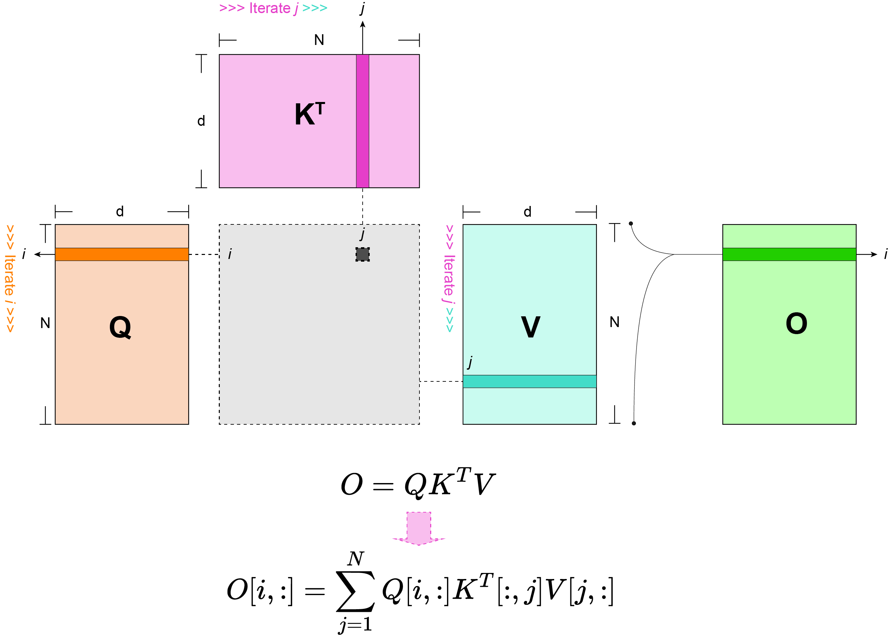
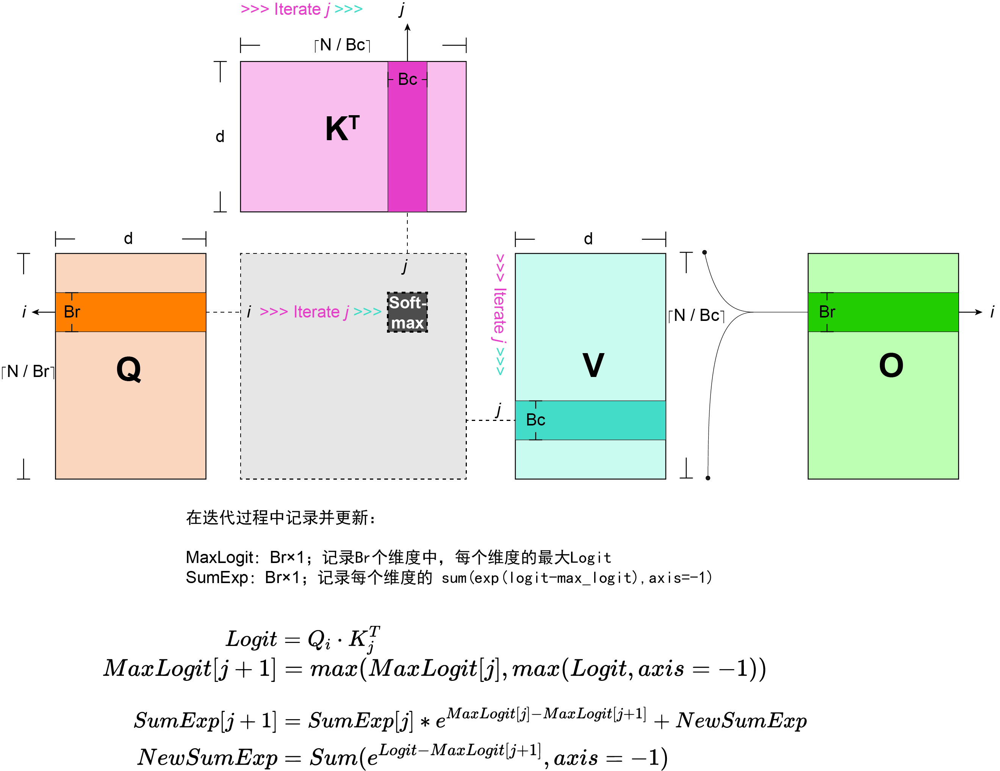

# Flash Attention

<style>
.indent {text-indent: 1em;}
</style>


## **待解决的问题是什么**

在Attention的计算过程中:

$$
O=Softmax(\frac{QK^T}{\sqrt{d}})\cdot V
$$

若按照上式逐步计算，中间结果$A=\frac{QK^T}{\sqrt{d}}$的尺寸为N*N。由于N通常较大（尤其对于长序列来说），Attention matrix需要较大的存储空间，并需要在SRAM缓存与HBM之间进行O(N^2)次的读取
与写入，造成严重的Memory Wall问题。

---

## **如何缓解Memory Wall？**
基本思路：

- 避免存储中间结果A，而是在遍历计算过程中直接计算对最终结果O的贡献，这样只需要进行O(Nd)次读取/写入 → Lazy Softmax。
- 分块进行计算

### **基本思路一：Lazy Softmax**
这里用没有Softmax的情况来说明：$O=QK^TV$。如图，我们不记录$A=QK^T$的中间结果，而是直接遍历待Reduce的`j`，求最终结果`O`。



对于含有Softmax的情况：$O=f(QK^T)V$：

1. $f(\cdot)$ 需要对每个元素求e指数，这个操作是Pointwise的，没有额外影响。
2. $f(\cdot)$ 中需要除去归一化因子（`j`这个维度的e指数之和）。这个操作需要对`j`这个维度进行Sum Reduce。

$$
O[i,:]=\frac{\sum_{j=1}^N e^{Q[i, :]K^T[:, j]} \times V[j, :]}{\sum_{j=1}^N e^{Q[i, :]K^T[:, j]}}
$$

### **工程细节：Safe Softmax**
在Softmax计算过程中，为了避免e指数$e^m$溢出，通常将Logit`x`减去待Reduce的这个维度的最大Logit $x_{max}$，再求指数。

$$
Softmax(\overrightarrow{X})=\frac {e^{\overrightarrow{X} - x_{max}}} {\sum_{i=1}^N e^{\overrightarrow{X}[i] - x_{max}}}
$$

---

## **完整实现：Tiling + Lazy Softmax + Safe Softmax**
设缓存大小为 $M$；$Q$, $K$, $V$ 存储在HBM中。
选定 $Q$ 的Block尺寸 $B_r=\min{(\lceil \frac {M} {4d} \rceil, d)}$。
选定 $K$, $V$的Block尺寸 $B_c=\lceil \frac {M} {4d} \rceil$。



**伪代码**：

```python
import numpy as np

def load_Q_from_HBM(idx):
    return Q[idx*N_Br: (idx+1)*N_Br, :]

def load_KT_from_HBM(idx):
    return KT[..., idx*N_Bc: (idx+1)*N_Bc]
    
def load_V_from_HBM(idx):
    return V[idx*N_Bc: (idx+1)*N_Bc]
    
def load_O_from_HBM(idx):
    return O[idx*N_Br: (idx+1)*N_Br, :]
    
def write_O_to_HBM(idx, new_O_block):
    O[idx:NBr: (idx+1)*NBr, :] = new_O_block
    

O = np.zeros((N, d))

for i in range(0, N_Br):
    # 记录迭代更新的归一化因子
    sum_e = np.zeros((N_Br, 1))
    # 记录沿 j 维度的最大logit
    max_logit = np.empty((N_Br, 1))
    max_logit.fill(-np.inf)
    for j in range(0, N_Bc):
        # (Br, d)
        q_block = load_Q_from_HBM(i)
        # (d, Bc)
        kt_block = load_KT_from_HBM(j)
        # (Bc, d)
        v_block = load_V_from_HBM(j)
        logit = q_block @ kt_block
        # 计算 max_logit 用于Safe Softmax
        new_max_logit = np.maximum(max_logit, np.max(logit, axis=-1, keepdims=True))
        exp_logit = np.exp(logit - new_max_logit)
        # 计算当前Block的归一化因子
        new_sum_e = sum_e * np.exp(max_logit - new_max_logit) + np.sum(exp_logit, axis=-1)
        # 更新输出结果
        o_block_i = load_O_from_HBM(i)
        o_block_i = o_block_i * sum_e * np.exp(max_logit - new_max_logit) + exp_logit @ v_block
        o_block_i = o_block_i / new_sum_e
        write_O_to_HBM(i, o_block_i)
        # 更新 max_logit, sum_e
        max_logit = new_max_logit
        sum_e = new_sum_e 
```
