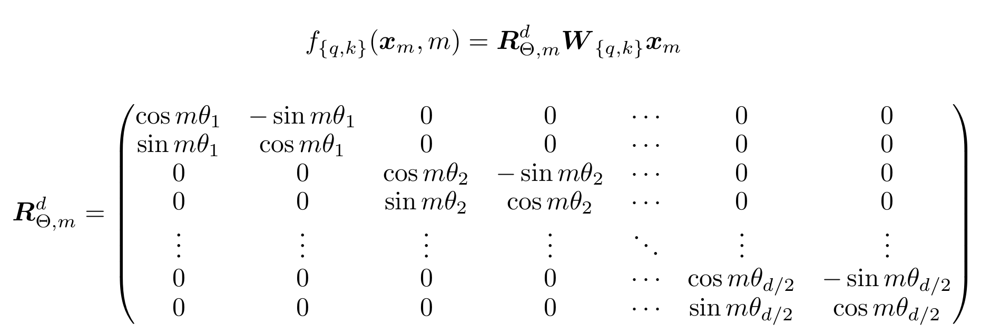

# **位置编码**

## **待解决问题**
Transformer中所有Token的地位是全同的，因此它无法获取位置信息，包括各Token的绝对位置与Token之间的相对位置。

## **绝对位置编码**
如经典Transformer结构中的位置编码方式：

将 Embedding 的 $d_{model}$ 个特征编码为 $\frac {d_{model}} {2}$ 个正交频率分量，
而时序维度中的位置对应于时间维度上的位置：

$$
PE(pos, 2i) = sin(pos / 10000^{2i/d_{model}}) （正弦分量）\\ 
PE(pos, 2i+1) = cos(pos / 10000^{2i/d_{model}}) （余弦分量）\\
$$

这种编码方式的优点是序列长度可以方便地外推（因为编码方式是固定的）。但是可能会由于外推后的编码值没有在预训练过程中进行足够的训练，
从而导致性能下降。

## **相对位置编码**
TODO

## **可学习位置编码**
顾名思义，即采用可学习的Embedding进行位置编码。

缺点是无法进行序列长度外推。

## **旋转位置编码 (Rotary Positional Embedding)**
旋转位置编码的形式不是加性的，而是乘性的。对一个Embedding向量进行旋转位置编码的过程，等价于将该向量的 $d_{model}$ 个维度拆分为 $\frac {d_{model}} {2}$
个二维子空间，并以不同的圆频率对该子空间的向量进行旋转操作。其中不同频率对应于Embedding向量的不同维度。

因此，旋转位置编码可以编码绝对位置信息。与此同时，在进行自注意力计算时，$QK^T$ 等价于将 $Q$ 与 $K$ 的旋转角度做差，因此RoPE同样可以编码相对位置信息。



其中 $\theta_i$ 指对应不同特征维度的不同频率。

$$
\theta_i = 10000^{\frac {-(i-1)} {d/2}}
$$

由于cos处于对角线，sin处于逆对角线(有一个负号)，所以该点乘可以简化为 Hardmard 积。

**代码**
<details>
<summary> RoPE </summary>
```python
import numpy as np

# x: 待编码向量
d_model = 1024
n_pos = 10
# (d_model, 1)
x = np.random.randn(d_model * n_pos).reshape((n_pos, d_model))

# (n_pos, 1)
pos_ids = np.arange(0, x.shape[0]).reshape((-1, 1))
# (d_model / 2, 1)
freq = np.power(10000, - 2 * np.arange(0, d_model // 2, 1) / d_model)

# (n_pos, d_model / 2)
cos = np.cos(pos_ids @ freq.T)
sin = np.sin(pos_ids @ freq.T)
# (n_pos, d_model)
cos = np.concatenate((cos, cos), axis=-1)
sin = np.concatenate((sin, sin), axis=-1)

# RoPE:
sin_x = np.concatenate((- x[:, x.shape[0] // 2: ], x[:, :x.shape[0] // 2]), axis=-1)
cos_x = x

rope_x = sin_x * sin + cos_x * cos
```

</details>
