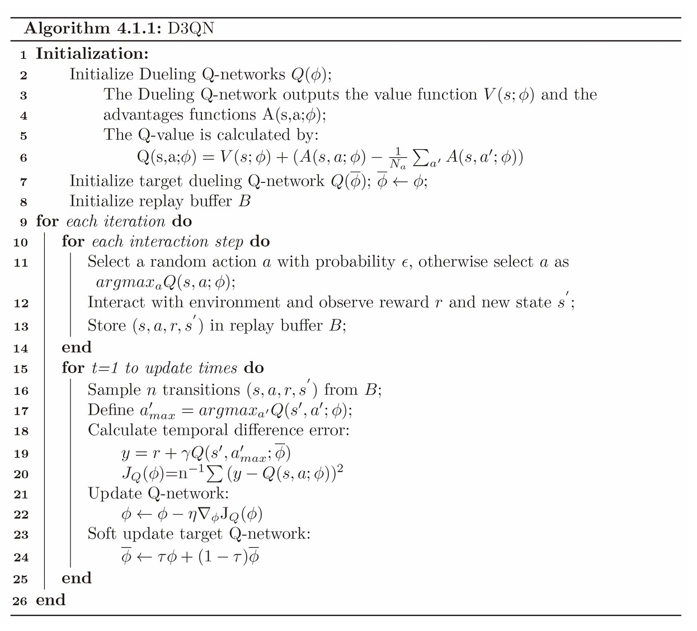

# **D3QN**

## **论文地址**

Dueling Q Network
[👉👉👉 Dueling Network Architectures for Deep Reinforcement Learning 👈👈👈](https://arxiv.org/pdf/1511.06581v3)

Double Q Network
[👉👉👉 Deep Reinforcement Learning with Double Q-learning 👈👈👈](https://arxiv.org/pdf/1509.06461)

## **原理**
在DQN的基础上做出改进：

**Dueling Q Network:** 将估计最优Q值的神经网络的输出层分为两部分：一部分输出最优状态价值函数$V^*(s)$，
另一部分输出各个动作的优势函数$A^*(s, a)$。$Q^*(s, a)$如下计算：

$$
Q^*(s, a) = V^*(s) + A^*(s, a) - \frac {1} {N_a} \sum_{\bar a} A^*(s, \bar a)
$$

"Dueling"指的是上式中的$A^*(s, a) - \frac {1} {N_a} \sum_{\bar a} A^*(s, \bar a)$，该式可以保证：

- 作为优势函数的这一项均值为0。
- 在使用时序差分误差损失进行反向传播时，不只会影响到采样数据中的$a$这个动作，其它动作也会参与进来。

直观上理解，"优势"的相对大小对于动作选取才是重要的，因此选择计算相对动作优势平均值的相对大小。

**Double Q Network:** 在Target Q值的计算中，将$\hat a_max$的选取与Q值的计算两部分工作分别交给实时更新的Q网络与Target Q网络, 即：

Q网络：$\hat a_{max} = argmax_{\bar a} Q(\hat s, \bar a; \theta)$

Target Q网络：$y = r + \gamma Q(\hat s, \hat a_{max}; \theta_{target})$

Double DQN可以缓解Overestimation问题。

## **伪代码**

