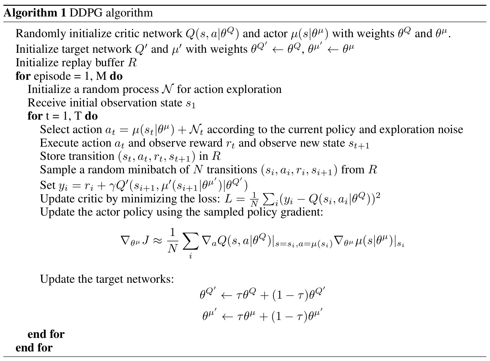

# **DDPG**

## **论文地址**

[👉👉👉 Deep deterministic policy gradient 👈👈👈](https://arxiv.org/pdf/1509.02971)

## **解决问题**
解决DQN无法处理连续动作空间的问题。

## **原理**
虽然DDPG的名字带有“Policy Gradient”，但是它实际上仍是基于最优价值函数估计的方法。

DQN的Q值网络中，动作a的可能取值对应于网络的输出维度，而连续动作空间中有无穷中可能动作取值，因此DQN的Q值网络无法处理连续动作空间的情况。
为此，可以将$(s, a)$均作为Q值网络的输入，该网络输出单个Q估计值（指最优Q函数的估计值）。

DDPG的优化过程同样依赖于贝尔曼最优方程：

$$
Q^*(s, a; \phi) ← r(\hat s; s, a) + \gamma Q^*(\hat s, \hat a_{max})
$$

使用数据$(s, a, r, \hat s)$训练Q值网络，但是上式中的$a_{max}$需要额外想办法处理（离散动作空间情况下，DQN中可以方便地取Q值输出最大的那个动作）。
为此引入一个新的神经网络 $\pi^*(s; \theta)$，专门用于估计最优动作 $a_{max}$。该策略网络产生的是确定性的策略。策略网络同样有一个Target版本，
用于计算Target Q值。

$$
a_{max} = \pi^*(s; \theta)
$$

### **Q值网络的训练目标**
Q值网络$Q^*(s, a; \theta)$的训练目标同样是最小化时序差分误差：

$$
\min_{\phi} (r + Q^*(\hat s, \pi^*(\hat s; \theta); \phi_{target}) - Q^*(s, a; \phi))^2
$$

这里同样使用了两个Q值网络：$Q$与$Q_{target}$，并且以软更新的方式更新Target Q网络：

$$
\phi_{target} ← (1 - \alpha) \phi_{target} + \alpha \phi
$$

### **最优策略网络的训练目标**
由于$\pi^*(s; \theta)$估计的是最优动作，该动作应该产生最优的Q值，因此该最优策略网络的训练目标为：

$$
\max_{\theta} Q(s, \pi^*(s; \theta))
$$

可见DDPG是通过Q值网络指导策略网络的更新。

使用了两个策略网络，$\pi(s;\theta)$与$\pi_{target}(s;\theta_{target})$，以软更新的方式更新Target网络：

$$
\theta_{target} ← (1 - \alpha) \theta_{target} + \alpha \theta
$$

由于DDPG本质上仍是基于贝尔曼最优方程，并使用Q值网络与策略网络分别去估计最优价值函数与最优策略，
因此DDPG同样是一种异策略（off-policy）的强化学习方法。

## **伪代码**

