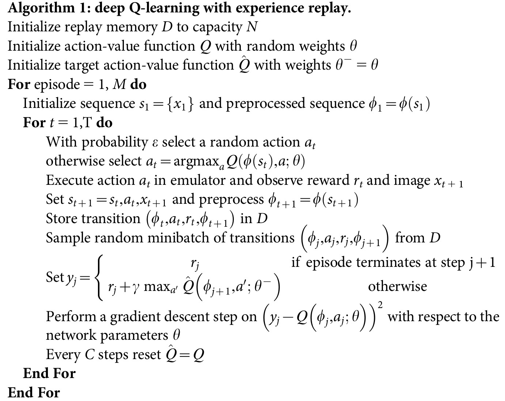

# **DQN**

## **论文地址**

[👉👉👉 Deep Q Network 👈👈👈](https://www.nature.com/articles/nature14236)

## **原理**
DQN是基于价值函数的强化学习方法，它采用神经网络模型估计最优状态-动作价值函数$Q^*(s, a)$，并采用时序差分估计法更新Q值网络。
具体来说，就是利用：

$$
Q^*(s, a; \phi) ← r(\hat s; s, a) + \gamma Q^*(\hat s, \hat a_{max})
$$

左边是目前Q值网络的估计值；右边是网络更新的Target，其中的$Q^*(\hat s, \hat a_{max})$ 由Target Q值网络估计得到。
(在DQN论文中，$\hat a_{max}$ 的选取以及Target Q值的评估均是由Target Q网络负责的；Double DQN把选取$\hat a_{max}$的任务交给了实时更新的Q网络)
可以通过梯度下降法最小化时序差分误差:

$$\min_{\phi} (r(\hat s; s, a) + \gamma Q^*(\hat s, \hat a_{max}) - Q^*(s, a; \phi))^2$$

为了保证稳定性，采用两个Q值网络，一个实时更新（即左边的估计值），一个用于产生Target Q（即右边的$Q^*(\hat s, \hat a_{max})$）。
每过一定轮次，将Q值网络的参数复制给Target Q值网络。

## **实现细节**
DQN只能用于离散动作空间的情况，它的Q值网络输入的是状态$s$，输出的是$dim(A)$个值，代表各个可能动作对应的Q值。
DQN无法处理连续动作空间的情况。

## **伪代码**

