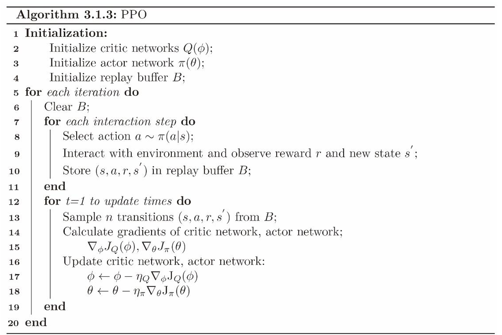

# **PPO**

## **论文地址**

[👉👉👉 Proximal Policy Optimization Algorithms 👈👈👈](https://arxiv.org/pdf/1707.06347)

## **原理**
PPO是基于策略梯度的Actor-Critic方法。

**策略梯度：**

$$
\nabla_{\theta} R = E_{\pi(\theta)} Q_{\pi (\theta)}(s, a) \log \pi (a|s; \theta) \\
=E_{\pi(\theta)} (V(s) + A_{\pi (\theta)}(s, a)) \log \pi (a|s; \theta) \\
= E_{\pi(\theta)} A_{\pi (\theta)}(s, a) \log \pi (a|s; \theta)
$$

可以这样简单直观地理解：该梯度希望增大优势大的动作的出现概率，减小优势小的动作的出现概率。

**优势函数的估计--GAE**
Generalized Advantage Estimation

[👉👉👉 Generalized Advantage Estimation 👈👈👈](https://arxiv.org/pdf/1506.02438)

优势函数已经定义：

$$
A(s, a) = Q(s, a) - V(s) = E_{s_1} (r + \gamma V(s_1) - V(s))
$$

现在的问题是：如何对 $A(s, a)$ 进行尽可能准确的估计。

最简单的估计是用单步的采样数据进行估计：

$$
A^{(1)}(s_{t}, a_{t}) = r_{t} + \gamma V(s_{t+1}) - V(s_t) = \delta_{t}
$$
其中 $\delta_t$ 就是在 t 时刻 使用数据 $(s_t, a_t, r_t, s_{t+1})$ 计算的单步时序差分误差

为了更准确一点，我们可以尝试使用更多步数的回报数据进行估计（A(s, a)）：

使用轨迹中两步的数据：

$$
A^{(2)}(s_{t}, a_{t}) = r_t + \gamma r_{t+1} + \gamma^2 V(s_{t+2}) - V(s_t) \\
= \{r_t + \gamma V(s_{t+1}) - V(s_t) \} + \gamma \{ r_{t+1} + \gamma V(s_{t+2}) - V(s_{t+1})  \} \\
= \delta_t + \gamma \delta_{t+1}
$$

使用轨迹中三步的数据：

$$
A^{(3)}(s_t, a_t) = r_t + \gamma r_{t+1} + \gamma^2 r_{t+2} + \gamma^3 V(s_{t+3}) - V(s_t) \\ 
= \delta_t + \gamma \delta_{t+1} + \gamma^2 \delta_{t+2}
\\
$$

使用轨迹中 $k$ 步的数据：
$$
A^{(k)}(s_t, a_t) = \gamma^{k} V(s_{t+k}) - V(s) + \sum_{l=0}^{k-1} r_t \gamma^{l} \\
= \sum_{l=0}^{k-1} \gamma^{l} \delta_{t+l}
$$

使用一步的回报数据估计 $A(s, a)$ 时，由于样本量较小，自举项 $\gamma V(s_{t+1})$ 占比较多，容易出现偏差。
使用多步的回报数据估计 $A(s, a)$ 时，样本量较多，数据方差较大。

为此，综合考虑多种步数的选择方案，引入GAE：

$$
A^{GAE}(s_t, a_t) = (1 - \lambda) (A^{(1)} (s_t, a_t) + \lambda A^{(2)} (s_t, a_t) + \lambda A^{(3)} (s_t, a_t) + ... ) \\
= (1 - \lambda) (\delta_t + \lambda (\delta_t + \gamma \delta_{t+1}) +\lambda^2 (\delta_t + \gamma \delta_{t+1} + \gamma^2 \delta_{t+2}) + ... ) \\
= (1 - \lambda) ((1 + \lambda + \lambda^2 + ...) \delta_t + \gamma \lambda (1 + \lambda + \lambda^2 ...) \delta_{t+1} + \gamma^2 \lambda^2(1 + \lambda + \lambda^2 + ...) \delta_{t+2} ) \\
= (1 - \lambda) (\frac {1} {1 - \lambda}) (\delta_t + \gamma \lambda \delta_{t+1} + \gamma^2 \lambda^2 \delta_{t+2} + ...) \\
= \sum_{l=0}^{\infty} (\gamma \lambda)^l \delta_{t+l}
$$

总结：

使用从 t 开始每一步的 单步时序差分估计，以折扣因子 $\gamma \lambda$ 求和。

$$
A^{GAE} = \sum_{l=0}^{\infty} (\gamma \lambda)^l \delta_{t+l} 
$$

**PPO的策略更新幅度剪切**

TRPO证明，根据策略梯度，以足够小的幅度（新旧策略的KL散度足够小）更新策略，可以保证策略单调变优：

$$
\max_{\theta} J(\theta) = \max_{\theta} E_t (\frac {\pi_{\theta} (a_t|s_t)} {\pi_{\theta_{old}}(a_t|s_t) } A(s_t, a_t)) \\
s.t. \quad E_t \{ D_{KL}(\pi_{\theta_{old}}(\cdot | s_t)||\pi_{\theta} (\cdot|s_t)) \le \delta \}
$$

其中 $\frac {\pi_{\theta} (a_t|s_t)} {\pi_{\theta_{old}}(a_t|s_t) }$ 
是在使用旧策略 $\pi_{\theta_{old}}$ 所得数据对 新策略 $\pi_{\theta}$ 进行训练优化时的重要性采样。

PPO利用该结论，将方法简化：直接对策略梯度进行裁剪：

$$
\max_{\theta} J(\theta) = \max_{\theta} E_t (\min ( \frac {\pi_{\theta} (a_t|s_t)} {\pi_{\theta_{old}}(a_t|s_t)} A(s_t, a_t), clip(\frac {\pi_{\theta} (a_t|s_t)} {\pi_{\theta_{old}}(a_t|s_t)}, 1-\epsilon, 1+ \epsilon) A(s_t, a_t)))
$$

**理解该裁切：**

1. 内层的 $clip$ :将新策略分布与旧策略分布的比例（记为 $ratio (s_t, a_t)$）钳制在 $(1 - \epsilon, 1 + \epsilon)$ 之间，使得：策略概率变化幅度超出一定范围的数据，对于策略梯度没有贡献。
2. 外层的 $min$ :只裁切过度的正确方向估计，不裁切错误方向估计，记未裁切的 $ratio (s_t, a_t) A(s_t, a_t)$ 为 $no \_ clip$，被裁切的为 $clip$。 
> 1. 若 $A(s_t, a_t)$ 为正，说明 $\pi(a_t|s_t)$ 需要增加
>> 1. 如果此时 $ratio (s_t, a_t) > 1$，说明此时策略的相比于旧策略的变化方向是正确的，只是需要裁切限制幅度；
>> 2. 如果$ratio (s_t, a_t) < 1$，说明新策略此时的变化方向是错误的（此时 $no\_ clip <= clip$），我们需要保证梯度能正常反传，以纠正该错误；
> 2. 同理，若$A(s_t, a_t)$ 为负，说明需要减小策略概率，
>> 1. 若 $ratio (s_t, a_t) > 1$，策略变化错误，需要梯度正常反传（此时 $no\_ clip <= clip$）；
>> 2. 若 $ratio (s_t, a_t) < 1$，策略变化正确，此时需要裁切限制变化幅度。

**价值网络的训练目标**

PPO的价值网络估计的是 状态价值函数 V(s)，采用的时序差分误差为：

$$
(r + \gamma Q(s, a; \phi_{old}) - V(s; \phi))^2 = (r + V(s; \phi_{old}) + A^{GAE}(s, a) - V(s; \phi))^2
$$

为什么这里使用Q值优化目标是合理的？

- 事实上由贝尔曼方程可知： $V(s) = E_{a \sim \pi} (Q(s, a))$ ，$V(s)$ 是 $Q(s, a)$ 的期望，$Q(s, a)$ 可以看作 $V(s)$ 的一个随机采样值，
这里可以认为我们用 $V(s)$ 的随机采样值 $Q(s, a)$ 代替了期望，正如我们在时序差分方法中做的随机近似。

## **伪代码**

