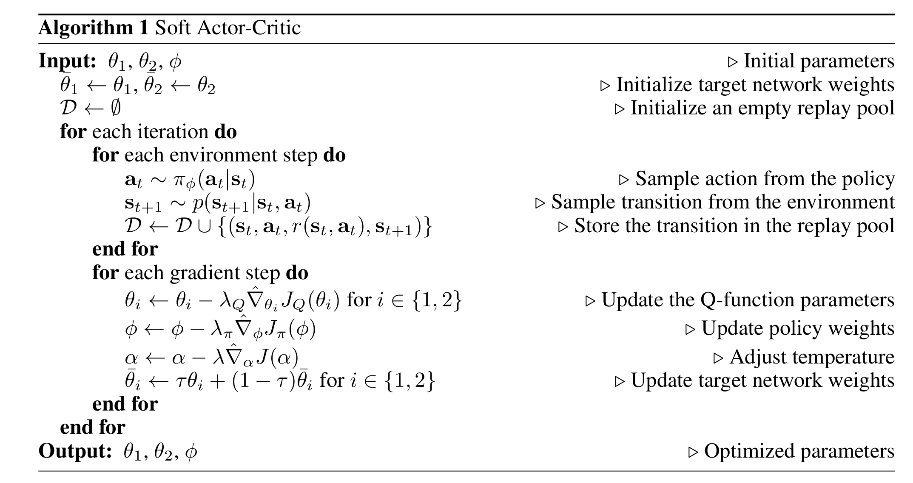

# **SAC**

## **论文地址**

[👉👉👉 Soft Actor Critic 👈👈👈](https://arxiv.org/pdf/1812.05905)

## **原理**
1. SAC引入了最大熵原理，即在强化学习最大化累计回报的学习目标中加入一项：最大化策略的信息熵。
2. SAC采用了玻尔兹曼策略，即假设策略的概率满足以 $-Q(s, a)$ 为能量项的玻尔兹曼分布。并基于该假设，根据Q值来指导策略网络的更新。

加入策略信息熵后：

$$
\max \sum_{t=1}^T r_t \gamma^{t-1} + \beta H(\pi (\cdot|s))
$$

相应地，状态价值函数的迭代式变为：

$$
V^*(s) = E_{a \sim \pi^*_{\theta}} Q^*(s, a) + \beta E_{a \sim \pi^*_{\theta}}(-log \pi(a|s))
$$

状态-动作价值函数的迭代式变为：

$$
Q^*(s, a) = \sum_{\hat s} P(\hat s; s, a)(r(\hat s; s, a) + \gamma \{ E_{\hat a \sim \pi^*_{\theta}} Q^*(\hat s, \hat a) + \beta E_{\hat a \sim \pi^*_{\theta}}(-log \pi(\hat a|\hat s)))\}
$$

以随机采样数据代替上式右边的期望值：

$$
Q^*(s, a) ← r(\hat s; s, a) + \gamma (Q^*(\hat s, \hat a) - \beta log \pi(\hat a | \hat s))
$$

则时序差分误差变为：

$$
(r + \gamma Q^*(\hat s, \hat a \sim \pi^*(\cdot|\hat s)) - Q^*(s, a))^2
$$

**Q网络的训练目标**即最小化上式的时序差分误差。

**Policy网络的训练目标**则是最小化其输出的策略概率分布与玻尔兹曼策略概率分布之间的KL散度。即：

$$
\min_{\theta} D_{KL} (\pi^*(\cdot|s; \theta) ||  \frac {\exp {(\frac {1} {\beta}} Q^*(s, \cdot))} {Z(s, \cdot)})
$$

即：

$$
\min_{\theta} \sum_{a \sim \pi^*(\cdot|s; \theta)} \pi^*(a|s; \theta) \log \pi^*(a|s) - \pi^*(a|s)(\log \exp {(\frac {1} {\beta} Q^*(s, a)) - log Z(s, \cdot))} 
$$

其中$Z(s, \cdot)$是配分常数，省略。即：

$$
\min_{\theta} E_{a \sim \pi^*(\cdot|s; \theta)} \log \pi^*(a|s; \theta) - \frac {1} {\beta} Q^*(s, a)
$$

以随机采样数据代替期望：

$$
\min_{\theta} \beta \log \pi^*(a|s; \theta) - Q^*(s, a)
$$

## **伪代码**
SAC同样使用了Target Q网络的技巧。且可见SAC同样是基于贝尔曼最优方程的，其本质还是基于估计最优价值函数，策略网络依附于价值函数。

