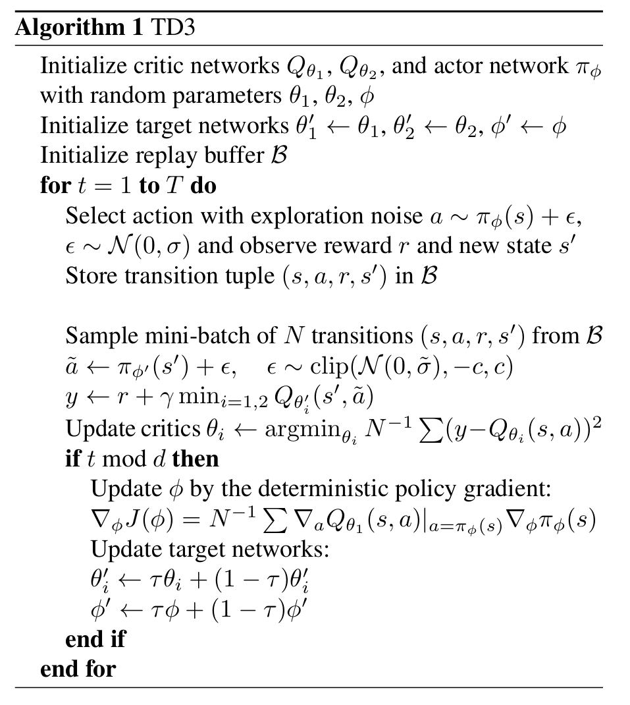

# **TD3**

## **论文地址**

[👉👉👉 Twin Deplayed Deep Deterministic Policy Gradient 👈👈👈](https://arxiv.org/pdf/1802.09477)

## **原理**
在DDPG的基础上：

1. 加入了Tiwn Q Network，以缓解价值的Overestimation问题。
采用两组Q Network同时估计Q值，并且在计算Target Q值时，采用较低的那个Q值，以减轻价值Overestimation的问题。
计算样本数据的Q(s, a)时，可以采用两组Q Network的平均值，这样可以保证反向传播时梯度会传导到两组Q-Net。
2. 延迟(每隔一定轮次)进行policy network的更新，以及Target Q网络与Target policy网络，增加训练的稳定性。

## **伪代码**
